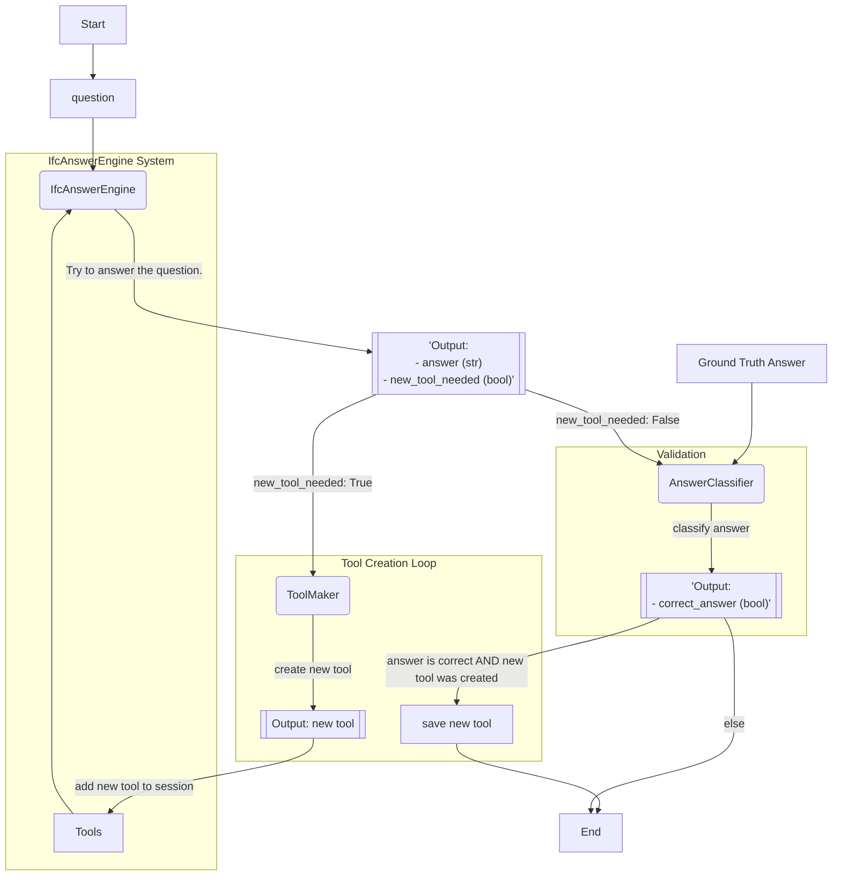

# IfcAnswerEngine - V3

An Engine that can answer any question related to a given BIM model in .ifc format. This project uses a multi-agent system (MAS) built with the [Smol-Agents](https://github.com/smol-ai/developer) library to process natural language queries.

## Roadmap

- Test the Engine with 2-3 functions, requiring new tools or not, to see how good it currently is and if there are any bugs with the current implementation.
- Test the current implementation of the training module.

### Options / Ideas

- Consider removing the Boilerplate instruction for the Engine ; maybe keep it for the ToolCreator (need to make sure this function can be loaded later on).
- Consider making the `save_new_tool` function more robust (check if name exist, if directory exist, if the written was successfull (read the file and compare it to the passed argument, better docstring, etc)).
- Replace the traditional LLM from the AnswerExtraction by an SLM fine-tuned/optimized for this task.
- Remove dependency to smolagents (Python interpreter & co.)
- See if it would be possible to work with `**kwargs` instead of Dict for `final_answer` to reduce number of errors. Maybe add an additional function to clean the code after the `fix_final_answer_code` in the implementation of `CodeAct`.

## System Overview

The IfcAnswerEngine operates in two distinct modes: Training and Inference.

### Training Mode

In training mode, the system learns to generate new tools to answer questions it initially cannot. It follows a self-improving loop:

1.  Given a question from a training set, the `IfcAnswerEngine` attempts to answer it using its existing set of tools.
2.  If the engine cannot answer the question, it signals that a new tool is needed.
3.  A specialized `ToolMaker` agent is invoked to generate a new Python tool capable of addressing the query.
4.  The engine uses this new tool to try and answer the question again.
5.  The generated answer is compared against a ground truth by an `AnswerClassifier`.
6.  If the answer is correct, the newly generated tool is permanently saved to the engine's toolset for future use.

This process is illustrated below:



### Inference Mode

In inference mode, the `ToolMaker` is disabled. The engine relies on its pre-trained set of tools to answer questions. To handle novel queries or missing functionalities, it has access to two special tools:
- `web_search`: To search the internet for information.
- `query_ifcopenshell_documentation`: To look up specifics of the `ifcopenshell` library.

All tools are executed within a sandboxed Python environment for security.

## Getting Started

### Prerequisites

- Python 3.12+
- `uv` package manager (`pip install uv`)

### Installation

1.  Clone the repository:
    ```bash
    git clone https://github.com/sylvainhellin/ifcAnswerEngineV3.git
    cd ifcAnswerEngineV3
    ```

2.  Create a virtual environment and install dependencies:
    ```bash
    uv venv
    source .venv/bin/activate
    uv pip install -e .
    ```

### Running Experiments

To trace and log experiments, MLflow is used. Start the MLflow server before running any training or inference tasks:

```bash
mlflow server --host 127.0.0.1 --port 5000 --backend-store-uri sqlite:///mlflow.sqlite
```

## Project Structure

The core logic is located in the `src/` directory:

-   `src/engine/`: Contains the main `IfcAnswerEngine` logic, including the agent, its components, and tool definitions.
-   `src/engine/tools/`: Stores the dynamically created tools.
-   `src/experiment/`: Holds scripts and data for running experiments, including datasets and models.
-   `src/config.py`: Configuration file for the project.
