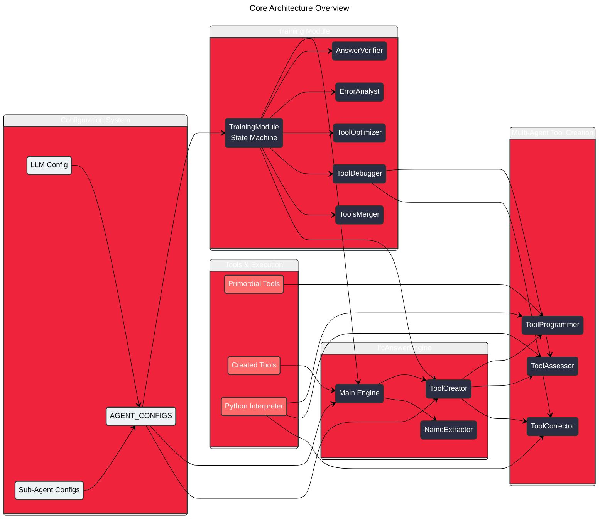
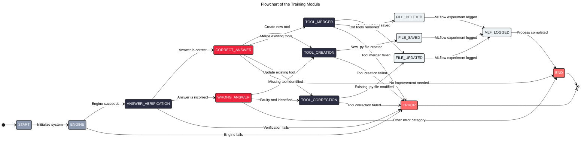
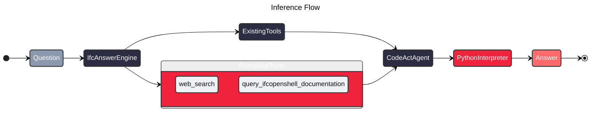

# IfcAnswerEngine - V3

An intelligent engine that answers questions about BIM models in .ifc format using a sophisticated multi-agent system. Built with [DSPy](https://github.com/stanfordnlp/dspy) and featuring dynamic tool creation, the system can learn new capabilities during training and apply them in inference.

## 🚀 Key Features

- **Multi-Agent Architecture**: Specialized agents for different tasks (programming, assessment, correction)
- **Dynamic Tool Creation**: Automatically generates new Python functions when needed
- **Hierarchical Configuration**: Clean, type-safe configuration system with Pydantic
- **Training & Inference Modes**: Learn new tools during training, apply them during inference
- **MLflow Integration**: Complete experiment tracking and logging
- **Type Safety**: Full type hints and validation throughout the codebase

## Start the services

### MLflow Tracking

Start MLflow server for experiment tracking:
```bash
mlflow server --host 127.0.0.1 --port 5000 --backend-store-uri sqlite:///mlflow.sqlite
```

### FastAPI backend

```zsh
uvicorn api.main:app --host 127.0.0.1 --port 8000 --reload
```

### Frontend

```zsh
cd frontend/
pnpm run preview
```

### NocoDB

NocoDB can be used for easier interaction with the dataset.

#### Installation

Ensure that docker is installed, and run:
```zsh
docker run -d \
  --name nocodb \
  -p 8080:8080 \
  -v PATH_TO_DB.db:/tmp/sqlite \
  nocodb/nocodb:latest
```

#### Start
```zsh
docker start nocodb
```

#### Stop
```zsh
docker stop nocodb
```


## 🏗️ System Architecture

### Core Components

The system is built around several specialized agents that work together:



### Agent Responsibilities

#### Core Engine
- **IfcAnswerEngine**: Main orchestrator that processes questions and coordinates other agents

#### Tool Creation & Management
- **ToolCreator**: Multi-agent system that creates new tools through iterative improvement
- **ToolProgrammer**: Generates initial function implementations using CodeAct
- **ToolAssessor**: Tests and evaluates generated functions through code execution
- **ToolCorrector**: Improves functions based on assessment feedback
- **NameExtractor**: Extracts function names from requirements

#### Training & Quality Assurance
- **AnswerVerifier**: Compares generated answers with ground truth using similarity scoring
- **ErrorAnalyst**: Analyzes incorrect answers to categorize errors and identify root causes
- **ToolOptimizer**: Identifies optimization opportunities for existing tools
- **ToolDebugger**: Multi-agent system that corrects faulty tools through iterative improvement
- **ToolsMerger**: Combines multiple existing tools into a single, more efficient tool

## 🔄 Training vs Inference Modes

### Training Mode

The system uses a sophisticated state machine to learn and improve through multi-agent collaboration:



#### Training Agents

The training module orchestrates multiple specialized agents:

- **AnswerVerifier**: Compares generated answers with ground truth using similarity scoring
- **ErrorAnalyst**: Analyzes incorrect answers to categorize errors and identify root causes
- **ToolOptimizer**: Identifies optimization opportunities for existing tools when answers are correct
- **ToolDebugger**: Multi-agent system that corrects faulty tools through iterative improvement
- **ToolsMerger**: Combines multiple existing tools into a single, more efficient tool
- **ToolCreator**: Creates entirely new tools when missing functionality is identified

### Inference Mode

The system uses its trained toolset to answer questions efficiently:



## ⚙️ Configuration System

The system uses a hierarchical configuration approach that eliminates parameter explosion:

### Simple Usage
```python
from src.engine import IfcAnswerEngine

# Clean initialization - everything comes from config!
engine = IfcAnswerEngine()
```

### Advanced Configuration
```python
from src.config import AGENT_CONFIGS, update_config
from src.config.agents import IfcAnswerEngineConfig, LLMConfig

# Update global configuration
update_config('ifc_answer_engine', max_retry=5, log_level='INFO')

# Or create custom configuration
custom_config = IfcAnswerEngineConfig(
    llm=LLMConfig(model_name="claude", max_tokens=32000),
    max_retry=3,
    log_level="DEBUG"
)
engine = IfcAnswerEngine(config=custom_config)
```

### Configuration Structure
```
src/config/
├── __init__.py          # Main exports
├── main.py             # Paths, API keys, models
└── agents.py           # Agent configurations
    ├── LLMConfig       # Language model settings
    ├── BaseAgentConfig # Common agent settings
    ├── ToolCreatorConfig
    ├── IfcAnswerEngineConfig
    └── TrainingModuleConfig
```

## 📁 Project Structure

```
bim-qas/
├── src/
│   ├── config/                    # Configuration system
│   │   ├── __init__.py
│   │   ├── main.py               # Core config (paths, models, etc.)
│   │   └── agents.py             # Agent configurations
│   │
│   ├── engine/                   # Main engine components
│   │   ├── __init__.py
│   │   ├── engine.py             # Main IfcAnswerEngine
│   │   ├── components/           # Agent implementations
│   │   │   ├── code_act.py       # CodeAct base agent
│   │   │   ├── tool_creator.py   # Multi-agent tool creation
│   │   │   ├── tool_programmer.py
│   │   │   ├── tool_assessor.py
│   │   │   ├── tool_corrector.py
│   │   │   ├── tool_debugger.py  # Multi-agent tool debugging
│   │   │   ├── tool_merger.py    # Tool combination system
│   │   │   ├── tool_optimizer.py # Tool optimization analysis
│   │   │   ├── answer_verifier.py # Answer similarity verification
│   │   │   ├── error_analyst.py  # Error categorization and analysis
│   │   │   └── extract_function_name.py
│   │   ├── schemas/              # Data models
│   │   │   ├── context.py        # Training context schema
│   │   │   ├── qa_pair.py        # Question-answer pair schema
│   │   │   ├── module_output.py
│   │   │   └── result.py
│   │   ├── tools/               # Tool management
│   │   │   ├── primordial/      # Built-in tools
│   │   │   ├── created/         # Dynamically created tools
│   │   │   └── get_created_tools.py
│   │   └── util/                # Utilities
│   │
│   └── experiment/              # Training and evaluation
│       ├── training/
│       │   └── training.py      # State machine-based training pipeline
│       ├── evaluation/
│       └── db/                  # Database and datasets
│
├── examples/                    # Usage examples
│   └── config_usage.py
├── docs/                       # Documentation
│   └── configuration_migration_guide.md
└── README.md
```

## 🚀 Getting Started

### Prerequisites

- Python 3.12+
- `uv` package manager

### Installation

1. Clone the repository:
   ```bash
   git clone https://github.com/sylvainhellin/bim-qas.git
   cd bim-qas
   ```

2. Create virtual environment and install dependencies:
   ```bash
   uv venv
   source .venv/bin/activate  # On Windows: .venv\Scripts\activate
   uv pip install -e .
   ```

3. Set up environment variables:
   ```bash
   cp .env.example .env
   # Edit .env with your API keys
   ```

### Quick Start

#### Basic Usage
```python
from src.engine import IfcAnswerEngine

# Initialize with default configuration
engine = IfcAnswerEngine()

# Ask a question about an IFC model
result = engine.forward(
    question="What is the height of the living room?",
    path_ifc_model="path/to/your/model.ifc"
)

print(result.result.answer)
```

#### Training Mode
```python
from src.experiment.training.training import TrainingModule
from src.experiment.datasets import load_train_dev_split

# Initialize training module with state machine
training = TrainingModule()

# Load training data
train, dev = load_train_dev_split()

# Process each QA pair through the state machine
for qa_pair in train:
    result = training.forward(qa_pair)
    print(f"Status: {result.status}")
    print(f"Correct Answer: {result.result.correct_answer}")
    print(f"Similarity Score: {result.result.similarity_score}")
    if result.result.new_tool_created:
        print(f"New Tool Created: {result.result.function_name}")
```

#### Training State Machine

The `TrainingModule` implements a sophisticated state machine that:

1. **Processes QA pairs** through the main engine
2. **Verifies answers** against ground truth using similarity scoring
3. **Analyzes correct answers** for optimization opportunities
4. **Diagnoses incorrect answers** to identify missing or faulty tools
5. **Creates, corrects, or merges tools** based on analysis results
6. **Tracks everything** in MLflow with detailed metrics and spans

Access the UI at: http://127.0.0.1:5000

## 🔧 Configuration Options

### Language Models
The system supports multiple LLM providers configured in `src/config/main.py`:
- OpenAI (GPT models)
- Anthropic (Claude models)
- Google (Gemini models)
- Groq (Llama models)
- Local models via Ollama

### Agent Configuration
Each agent can be individually configured:
```python
from src.config import update_config

# Configure engine behavior
update_config('ifc_answer_engine', max_retry=3, log_level='INFO')

# Configure tool creation
update_config('tool_creator', max_iter=5)

# Configure sub-agents
update_config('tool_programmer', max_iters=15)
```

## 🧪 Examples

See `examples/config_usage.py` for comprehensive configuration examples:
- Default configuration usage
- Global parameter overrides
- Custom configuration objects
- LLM configuration management

## 📚 Documentation

- [Configuration Migration Guide](docs/configuration_migration_guide.md) - Detailed guide on the new config system
- [API Documentation](docs/api.md) - Complete API reference (coming soon)
- [Training Guide](docs/training.md) - How to train the system (coming soon)

## 🤝 Contributing

1. Fork the repository
2. Create a feature branch
3. Make your changes
4. Add tests if applicable
5. Submit a pull request

## 📄 License

This project is licensed under the MIT License - see the LICENSE file for details.

## 🏷️ Version History

- **v3.0**: DSPy-based architecture with state machine training system
  - Advanced state machine-based training module with multi-agent orchestration
  - Sophisticated answer verification, error analysis, and tool optimization
  - Automated tool creation, correction, and merging capabilities
  - Hierarchical configuration system with complete type safety
  - Comprehensive MLflow integration with detailed tracking and metrics
- **v2.0**: Multi-agent system with tool creation capabilities
- **v1.0**: Initial implementation with basic question answering
