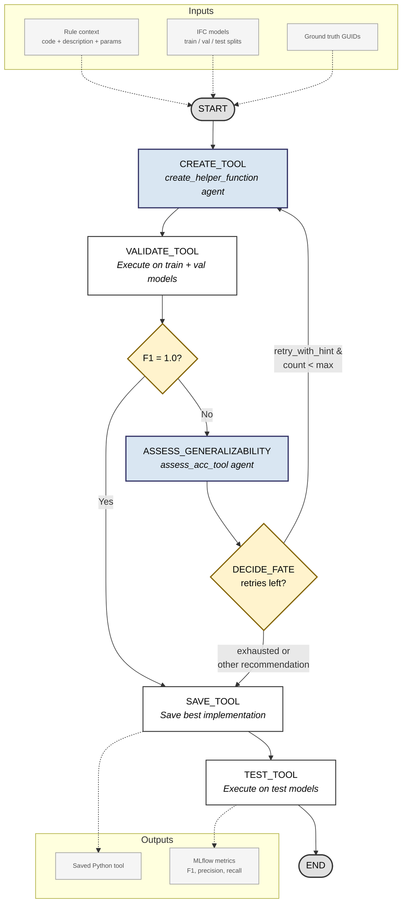

# ACC Training Pipeline

```mermaid
graph TD
    START([START]):::startEnd --> CREATE[CREATE_TOOL<br/><i>create_helper_function agent</i>]:::llm
    CREATE --> VALIDATE[VALIDATE_TOOL<br/><i>Execute on train + val models</i>]:::process

    VALIDATE --> F1{F1 = 1.0?}:::decision
    F1 -->|Yes| SAVE[SAVE_TOOL<br/><i>Save best implementation</i>]:::process
    F1 -->|No| ASSESS[ASSESS_GENERALIZABILITY<br/><i>assess_acc_tool agent</i>]:::llm

    ASSESS --> DECIDE{DECIDE_FATE<br/>retries left?}:::decision
    DECIDE -->|retry_with_hint &<br/>count < max| CREATE
    DECIDE -->|exhausted or<br/>other recommendation| SAVE

    SAVE --> TEST[TEST_TOOL<br/><i>Execute on test models</i>]:::process
    TEST --> END([END]):::startEnd

    subgraph Inputs
        direction LR
        I1[Rule context<br/>code + description + params]:::io
        I2[IFC models<br/>train / val / test splits]:::io
        I3[Ground truth GUIDs]:::io
    end

    subgraph Outputs
        direction LR
        O1[Saved Python tool]:::io
        O2[MLflow metrics<br/>F1, precision, recall]:::io
    end

    I1 -.-> START
    I2 -.-> START
    I3 -.-> START
    SAVE -.-> O1
    TEST -.-> O2

    classDef startEnd fill:#e0e0e0,stroke:#333,stroke-width:2px,color:#000
    classDef process fill:#fff,stroke:#333,stroke-width:1.5px,color:#000
    classDef llm fill:#d9e6f2,stroke:#336,stroke-width:2px,color:#000
    classDef decision fill:#fff3cd,stroke:#856404,stroke-width:2px,color:#000
    classDef io fill:#f5f5f5,stroke:#999,stroke-width:1px,color:#555,font-size:11px
```
