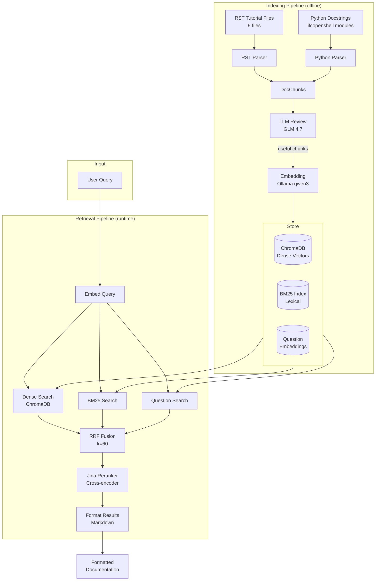

# Technical Report: `query_ifcopenshell_docs` Implementation

## Overview

`query_ifcopenshell_docs` is a hybrid documentation retrieval system that combines dense vector search, lexical BM25 search, and cross-encoder reranking to retrieve relevant IfcOpenShell documentation chunks.

**Entry point**: `src/tools/initial/query_ifcopenshell_documentation.py`

---

## Architecture Diagram



---

## Key Components

### 1. Documentation Sources

| Source | Location | Content |
|--------|----------|---------|
| RST Tutorials | `src/docs_indexer/external/ifcopenshell-docs/.../docs/` | 9 tutorial files (hello_world, geometry, selectors, etc.) |
| Python Docstrings | `src/docs_indexer/external/ifcopenshell-docs/.../ifcopenshell/` | Module, class, function docstrings |

### 2. Chunking (`src/docs_indexer/`)

- **Python**: Extracts module docstrings, class docstrings with methods, public functions (>30 chars)
- **RST**: Splits by section headers, cleans directives, converts to markdown

### 3. Chunk Model

```python
@dataclass
class DocChunk:
    id: str              # SHA256 hash (16 chars)
    content: str         # Documentation text
    chunk_type: str      # "function", "class", "method", "module", "tutorial_section"
    name: str            # Identifier name
    module: str          # Python module path
    signature: str       # Function/class signature
    questions: list[str] # LLM-generated hypothetical questions
```

### 4. Embedding

- **Backend**: Ollama (`qwen3-embedding:0.6b`) or sentence-transformers (`BAAI/bge-m3`)
- **Dimension**: 1024

### 5. Hybrid Retrieval (`src/docs_indexer/retriever.py`)

| Method | Source | Purpose |
|--------|--------|---------|
| Dense Search | ChromaDB | Semantic similarity via cosine distance |
| BM25 Search | Pickle index | Lexical/keyword matching |
| Question Search | ChromaDB | Match against hypothetical Q&A pairs |

**RRF Fusion**: `score(d) = Σ 1/(k + rank(d))` with k=60

### 6. Reranking

- **Model**: Jina Reranker v3 MLX (`jinaai/jina-reranker-v3-mlx`)
- **Purpose**: Cross-encoder semantic reranking of top candidates

---

## Storage

| Component | Path | Size |
|-----------|------|------|
| ChromaDB | `src/db/chroma_docs/chroma.sqlite3` | ~10MB |
| BM25 Index | `src/db/bm25_index.pkl` | ~874KB |
| Review Cache | `src/db/doc_review_cache.json` | ~343KB |

---

## Configuration

| Variable | Default | Options |
|----------|---------|---------|
| `DOC_BACKEND` | `custom` | `custom`, `context7` |
| `EMBEDDING_BACKEND` | `ollama` | `ollama`, `st` |

**Retrieval Parameters**:
- `top_k=5` (final results)
- `search_limit=25` (per-method candidates)
- `rerank_limit=15` (passed to reranker)

---

## MLflow Tracing

All retrieval steps are traced with nested spans:
- `query_ifcopenshell_docs` (parent)
  - `embed_query`, `dense_search`, `bm25_search`, `question_search`, `rrf_fusion`, `reranking`

---

## Output Format

Returns markdown with ranked chunks:

```markdown
## 1. function_name (module.path)
```python
def function_name(args) -> return_type
```
Docstring content...

---

## 2. another_function (module.path)
...
```
